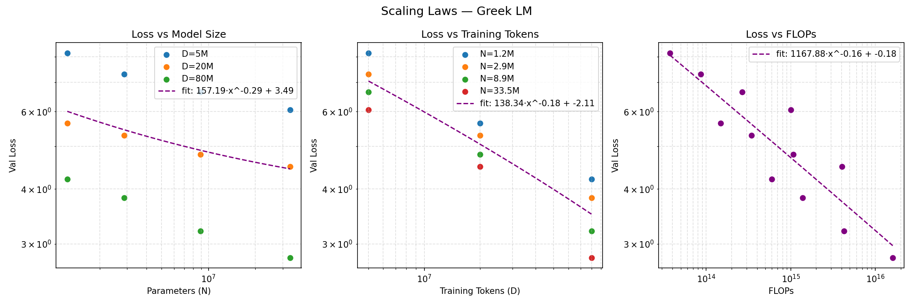
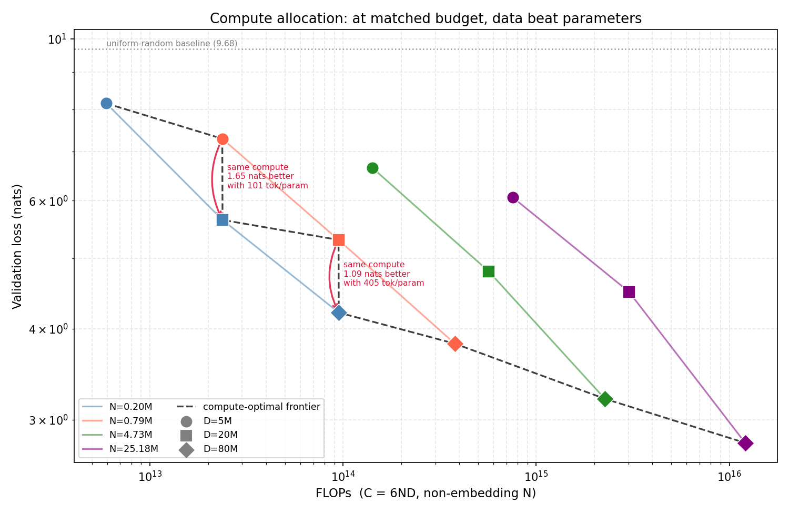
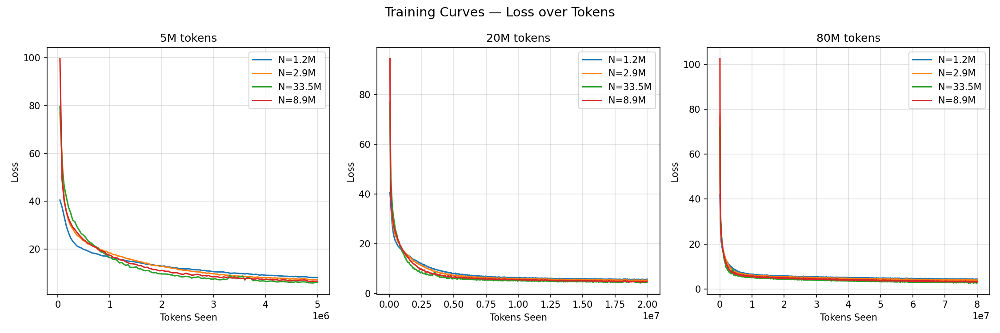

# Greek Scaling Laws

Empirically deriving neural scaling laws for a Greek-language LM — tokenizer, model, training loop, and power-law fits all built from scratch.

A 12-run sweep over 4 model sizes × 3 token budgets, trained on [TinyStories-GR](https://huggingface.co/datasets/alexliap/tinystories-gr), measuring how validation loss responds to parameters (N), data (D), and compute (C ≈ 6ND). Inspired by [Kaplan et al. (2020)](https://arxiv.org/abs/2001.08361) and [Hoffmann et al. (2022)](https://arxiv.org/abs/2203.15556), at roughly a millionth of the scale.

Everything runs on a single GPU — or on CPU, slowly.

> **N is non-embedding parameters throughout.** With a 16k vocabulary against `d_model=64`, the token embedding is 84% of the smallest model's parameters, so counting it would make the N axis measure vocabulary size rather than capacity. See [A correction worth reading](#a-correction-worth-reading).

---

## Headline results

**1. The parameter exponent matches the literature.** Measured per-slice on non-embedding N:

```
b_N = -0.065 ± 0.016        Kaplan et al.: -0.076
```

**2. At matched compute, data beat parameters — decisively.** The grid contains two pairs of runs at near-identical FLOPs. In both, the smaller model given more data won:

| Compute | Winner | Loss | Loser | Loss | Margin |
|---|---|---:|---|---:|---:|
| 2.37e13 | N=0.20M, D=20M | **5.643** | N=0.79M, D=5M | 7.294 | 1.65 nats |
| 9.46e13 | N=0.20M, D=80M | **4.211** | N=0.79M, D=20M | 5.299 | 1.09 nats |

**3. But the data exponent is inflated, and I can show why.** `b_D = -0.254 ± 0.019` against Kaplan's -0.095 — 2.7× too steep. At constant learning rate, "more tokens" also means "more optimizer steps," and since no run converged, the D axis is measuring optimization progress as much as data. This is the honest headline: one axis reproduces, the other is confounded by a fixable recipe choice.

| | best run | worst run |
|---|---|---|
| Config | N=25.2M, D=80M | N=0.20M, D=5M |
| Val loss | **2.790** | 8.156 |
| Perplexity | 16.3 | ~3,500 |

For scale: a uniform predictor over the 16k vocabulary sits at ln(16000) = **9.68 nats**. The weakest run clears that by only 1.5 nats.

---

## Results

| N (non-emb) | D (tokens) | C = 6ND | tokens/param | Val loss |
|---:|---:|---:|---:|---:|
| 0.20M | 5M | 5.9e12 | 25 | 8.156 |
| 0.20M | 20M | 2.4e13 | 101 | 5.643 |
| 0.20M | 80M | 9.5e13 | 405 | 4.211 |
| 0.79M | 5M | 2.4e13 | 6 | 7.294 |
| 0.79M | 20M | 9.5e13 | 25 | 5.299 |
| 0.79M | 80M | 3.8e14 | 101 | 3.818 |
| 4.73M | 5M | 1.4e14 | 1 | 6.653 |
| 4.73M | 20M | 5.7e14 | 4 | 4.798 |
| 4.73M | 80M | 2.3e15 | 17 | 3.207 |
| 25.18M | 5M | 7.6e14 | 0.2 | 6.061 |
| 25.18M | 20M | 3.0e15 | 0.8 | 4.497 |
| 25.18M | 80M | 1.2e16 | 3 | **2.790** |

Machine-readable in [`results.csv`](results.csv); fitted coefficients in `scaling_fits.json`; per-run loss traces in [`curves/`](curves/).

### Loss vs N, D, and compute



Marginal exponents are fit **one slice at a time**, holding the other axis fixed — a pooled fit over all 12 points lets each axis absorb the other's effect:

| Axis | Per-slice exponents | Mean | Kaplan et al. |
|---|---|---:|---:|
| **N** | -0.060, -0.048, -0.087 | **-0.065 ± 0.016** | -0.076 |
| **D** | -0.238, -0.234, -0.263, -0.280 | **-0.254 ± 0.019** | -0.095 |

Every slice fits its power law tightly (R² = 0.98–0.9999), so the exponents themselves are well determined — the question is what they measure, not how cleanly they were estimated.

### The joint surface

Fitting the Chinchilla form over all 12 points at once, which separates the axes by construction rather than by slicing:

```
L(N, D) = E + A/N^α + B/D^β

E = 0.00 ± 1.67      α = 0.253 ± 0.181      β = 0.334 ± 0.127
R² = 0.987           RMSE = 0.179 nats
```

The surface fits well, but **the parameters are weakly identified** and the honest reading is in the error bars: E pins to its lower bound at zero because nothing converged, so there's no curvature in the data to locate an irreducible-loss floor. And α and β overlap heavily — the implied allocation of `N* ∝ C^0.57, D* ∝ C^0.43` is *not* statistically distinguishable from Chinchilla's balanced `C^0.5 / C^0.5`. This grid can say that both axes matter and roughly how much; it cannot resolve the optimal split.

### Compute allocation



The pooled `L(C) = a·C^b + c` fit returns **b = -0.148 ± 0.218 with R² = 0.66** — an error bar larger than the estimate. That is a real finding, not a failed fit: a factorial N×D grid is the wrong instrument for a compute exponent, because runs sharing a FLOP budget can sit at wildly different (N, D) splits and therefore wildly different losses. Chinchilla uses iso-FLOP profiles precisely to avoid this. The two matched-compute pairs above are worth more than the pooled fit.

Where the grid does allow a matched comparison, the direction is unambiguous and the winners are very data-heavy — 101 and 405 tokens/param, far past Chinchilla's ~20. Part of that is genuine (these runs sit deep on the over-parameterized side of the optimum: the largest model saw just 0.2 tokens per parameter), and part is the constant-LR confound inflating the value of extra tokens.

### Training curves



Every curve is still descending steeply at cutoff. None of these runs converged — by design (the brief asks for the trend, not convergence) and by consequence (see [Limitations](#limitations)).

---

## A correction worth reading

The first version of this analysis reported **b_N = -0.295** against Kaplan's -0.076 and explained the 4× gap as "small scale." That explanation was wrong, and the gap was mostly an artifact of two methodology errors:

**Counting embeddings in N.** Kaplan et al. (§2.1) define N as *non-embedding* parameters, because the embedding table scales with vocabulary, not capacity. Here the distortion was severe, and — crucially — not constant across the grid:

| d_model | Total N | Embeddings | Non-embedding N |
|---:|---:|---:|---:|
| 64 | 1.24M | **84.0%** | 0.20M |
| 128 | 2.87M | 72.5% | 0.79M |
| 256 | 8.89M | 46.8% | 4.73M |
| 512 | 33.5M | 24.8% | 25.18M |

The smallest "1.2M-parameter model" was 84% lookup table. Because the embedding share falls monotonically as models grow, the old N axis measured capacity confounded with a shrinking constant — and spanned only 27× where the real capacity range is 127×.

**Comparing incompatible exponents.** The -0.295 came from an `a·N^b + c` fit with a free offset, then compared against Kaplan's α_N, which is defined for a pure power law with no additive constant. Different quantities.

Correcting both — non-embedding N, per-slice fits, no offset — moves the exponent from -0.295 to **-0.065 ± 0.016**, which brackets Kaplan's -0.076. The same correction rescales the FLOPs axis (embedding lookups are gathers, not matmuls; C was overstated ~6× for the smallest model).

No retraining was needed: validation loss doesn't depend on how parameters are counted, and the count is a deterministic function of the config. [`scripts/recompute_params.py`](scripts/recompute_params.py) recovers each run's config, recomputes N and C, and refuses to write unless the analytic formula reproduces every recorded total exactly. It is also cross-checked against live instantiated models.

---

## Quickstart

```bash
git clone https://github.com/fourlhs/greek-scaling-laws.git
cd greek-scaling-laws
bash run_all.sh
```

That is the whole pipeline: installs dependencies, trains the tokenizer, runs all 12 experiments, and renders every plot in this README. On a single modern GPU expect a few hours, dominated by the 80M-token runs.

Useful switches:

```bash
SKIP_INSTALL=1 bash run_all.sh     # dependencies already present
KEEP_RESULTS=1 bash run_all.sh     # append rather than archiving results.csv
```

Or drive the stages by hand:

```bash
pip install -e .                   # or: uv sync
python train_tokenizer.py          # ~10 min, writes greek_bpe_tokenizer.json
python test_tokenizer.py           # round-trip check on a Greek sentence

python train.py --n_layers 6 --d_model 256 --n_heads 8 --n_tokens 20000000

python scripts/analyze.py          # fits + plots/scaling_laws.png + scaling_fits.json
python scripts/plot_curves.py      # plots/training_curves.png
python scripts/plot_isoflops.py    # plots/isoflops.png
```

The tokenizer and the tokenized corpus cache (`dataset_cache.npy`) are build artifacts, regenerated on first run and gitignored. The first `train.py` invocation tokenizes the corpus and caches it; every later run memory-maps that file, so the cost is paid once.

---

## Repository layout

```
train_tokenizer.py           Byte-level BPE, 16k vocab, greek_translation only
test_tokenizer.py            Round-trip check on a Greek sentence
model.py                     GPT: pre-LN decoder, SDPA attention, tied embeddings
train.py                     Dataset build/cache, training loop, eval, CSV logging
run_all.sh                   Full pipeline: deps -> tokenizer -> sweep -> plots

scripts/analyze.py           Per-slice marginals, compute fit, joint Chinchilla surface
scripts/recompute_params.py  Backfills non-embedding N into an existing results.csv
scripts/plot_curves.py       Training curves per token budget
scripts/plot_isoflops.py     Compute-allocation plot with matched-budget pairs
scripts/plot_memory.py       RSS: full np.load vs mmap

model_walkthrough.ipynb      Annotated forward pass — tensor shapes, attention maps
report/report.md             Full write-up
results.csv                  n_params, n_params_non_embed, n_tokens, flops, val_loss
scaling_fits.json            Fitted coefficients emitted by analyze.py
curves/                      Per-run loss traces
```

---

## Method

### Data

`alexliap/tinystories-gr` — 2.14M Greek children's stories machine-translated from TinyStories. Only the `greek_translation` column is touched; `original_text` never enters the pipeline, so no English reaches the model or the tokenizer.

Stories are tokenized, joined with `<|endoftext|>`, and the flat stream is chunked into 257-token sequences (256 input + 1 shifted target). Chunks are shuffled once under a fixed seed (`default_rng(42)`) and split 90/10 train/val — shuffled *before* splitting, so validation isn't a contiguous tail of the corpus.

### Tokenizer

| | |
|---|---|
| Algorithm | Byte-level BPE (HuggingFace `tokenizers`) |
| Vocab size | 16,000 |
| Special tokens | `<\|endoftext\|>`, `<\|pad\|>` |
| Pre-tokenizer / decoder | `ByteLevel` (case- and whitespace-preserving) |

16k is a deliberate middle ground for Greek. The language is heavily inflected — one lemma spawns many surface forms through case, number, tense, and aspect endings — so too small a vocabulary shreds common words into character soup and inflates D for no linguistic gain, while too large a one wastes embedding capacity on rare forms the model can't afford at these sizes. Byte-level BPE gives full Unicode coverage with no `<unk>`, polytonic marks included.

One tokenizer is trained once and reused byte-identically across all 12 runs, so D is measured in a consistent unit.

### Model

A decoder-only transformer in PyTorch, randomly initialized per run — no pretrained weights anywhere:

- Pre-LayerNorm blocks, residual around attention and MLP
- Causal multi-head attention via `F.scaled_dot_product_attention`
- MLP with 4× expansion and GELU
- Learned positional embeddings, 256-token context
- Token embedding weight-tied to the LM head

### Grid

| Layers | d_model | Heads | Total params | **Non-embedding N** |
|---:|---:|---:|---:|---:|
| 4 | 64 | 4 | 1.24M | 0.20M |
| 4 | 128 | 4 | 2.87M | 0.79M |
| 6 | 256 | 8 | 8.89M | 4.73M |
| 8 | 512 | 8 | 33.51M | 25.18M |

× token budgets **5M / 20M / 80M** = 12 runs.

AdamW, lr 3e-4 constant, batch 32 × 256 tokens = 8,192 tokens/step — so the budgets are 610 / 2,441 / 9,766 optimizer steps. Validation loss is mean cross-entropy over 50 held-out batches (~410k tokens).

---

## Limitations

**Nothing converged, and D is entangled with optimizer progress.** The dominant caveat. At constant LR with no warmup or decay, the 5M-token runs get 610 steps; their losses (6–8 nats against a 9.68 random baseline) are transient, not performance. The D axis therefore partly measures where training was stopped rather than how much data was seen — the main reason `b_D` lands at -0.254 against Kaplan's -0.095. A cosine schedule with warmup, length-matched per run, is the first thing to fix.

**The grid is factorial, not iso-FLOP.** Good for clean marginals in N and D, weak for a compute exponent (R² = 0.66, error bar larger than the estimate). Deriving a trustworthy compute-optimal frontier needs iso-FLOP profiles: fix a budget, sweep the (N, D) split, find the minimum.

**One learning rate for a 127× parameter range.** 3e-4 everywhere, untuned. Optimal LR shifts with width, so one value systematically handicaps some sizes relative to others, and there's no way to know which without a sweep.

**Model initialization is unseeded.** The data shuffle is seeded; `torch.manual_seed` is never called. Reruns won't reproduce exactly, and with one run per cell there's no variance estimate to separate real curvature from noise. Error bars quoted here are across slices, not across seeds.

**Five fitted parameters against 12 points spanning ~1.3 decades.** The joint fit is well-conditioned enough to be informative and not enough to be conclusive — α and β overlap, and E is unidentified.

**The tokenizer is trained on the full corpus**, validation split included. Standard practice, and the effect is small, but it is a technical train/test contact point worth naming.

**Machine-translated Greek.** The corpus is translated TinyStories, not native text. Translation artifacts, a narrow register, and a child-directed vocabulary mean these exponents describe *this corpus*, not the Greek language.

**Dataset construction is memory-hungry.** `build_dataset` accumulates the whole token stream in a Python list before the `np.uint16` cast, which peaks at tens of GB on the full corpus. Streaming the tokenization into a preallocated array would fix it.

### Given more compute

Warmup + cosine decay scaled to each run's length, so D measures data rather than optimizer progress; iso-FLOP profiles to pin the allocation frontier properly; a short LR sweep per model size; 3 seeds per cell for real error bars; and D extended far enough that the largest models approach their loss floor, so the fits describe convergence instead of the transient.

---

## References

- Kaplan et al. (2020) — [Scaling Laws for Neural Language Models](https://arxiv.org/abs/2001.08361)
- Hoffmann et al. (2022) — [Training Compute-Optimal Large Language Models](https://arxiv.org/abs/2203.15556)
- Sardana & Frankle (2023) — [Beyond Chinchilla-Optimal](https://arxiv.org/abs/2401.00448)
- HuggingFace [`tokenizers`](https://huggingface.co/docs/tokenizers)
